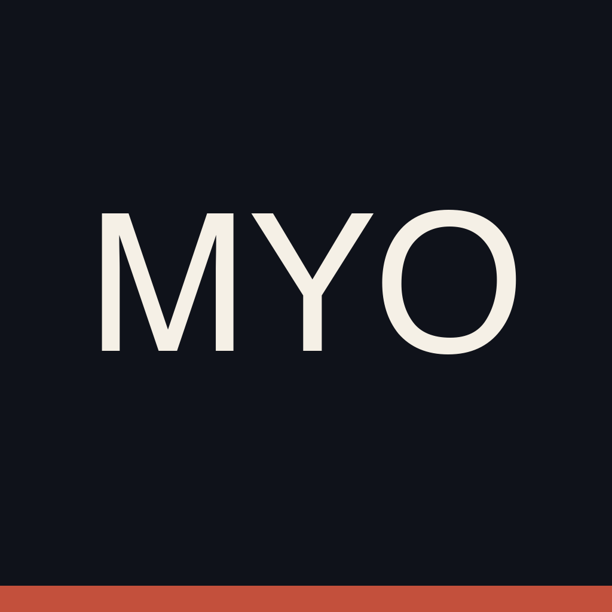

<p align="center">
  
</p>

<h1 align="center">MYO</h1>

<p align="center">An iOS strength-training coach that actually knows your plan.<br>
Native SwiftUI · Firebase · Gemini · designed and built by one person, with an AI studio as the design team.</p>

---

## What it is

MYO is a conversational fitness coach for people who lift. You tell it your goals, equipment, injuries and schedule; it writes a multi-week program, walks you through each session, and adjusts the plan when life happens. The coach can see your current week, your logged sets, your body-weight trend and the facts you've told it, so "what should I cut if I only have 25 minutes on Friday" gets a real answer with real numbers.

It is a design project as much as an engineering one. The interface is a cream-paper "living dossier": hairlines, stamps, section labels and a brick accent, forced light mode, no SaaS gloss. The art direction, personas, layout specs and clickable prototype are in [`docs/design/`](docs/design/).

**Status:** in TestFlight. Not on the App Store yet.

## The four tabs

| Tab | What it does |
|---|---|
| **Coach** | Chat with the coach. Sign in with Apple, voice input, cited sources, and proposal cards you can apply or decline. |
| **Train** | This week's plan, day by day. Start a session, swap an exercise, step weights, update a baseline, play an exercise sequence. |
| **Record** | History and milestones. Six-week adherence bars, strength trends per lift, body-weight trend with a safety callout. |
| **You** | Profile, goals, equipment, coaching protocol, non-negotiables, injuries and limitations, disliked exercises. |

A conversational onboarding gates the tabs until the coach has enough to write a first program.

## How it works

```
iPhone (SwiftUI)  ──callable──▶  Cloud Functions (TypeScript)  ──▶  Firestore
                                        │
                                        ├─ Gemini 2.5 Flash (or OpenRouter) with a tool loop
                                        ├─ deterministic safety layer (never model-authored)
                                        └─ schedulers: weekly rollover, daily follow-ups
```

- **Firestore-first chat.** The app writes a user message; a Firestore trigger runs the coach and writes the reply. Clients can only ever create `user` messages. Security rules are covered by 36 test files that run against the emulator in CI.
- **Coach tools.** `adapt_plan`, `accept_plan_adjustment`, `find_exercise_swaps`, `remember_user_fact`, `ask_follow_up_question` and friends, each with a Zod contract. The model proposes; the server validates and applies.
- **Safety is code, not prompt.** Injury triage runs a server-side severe-symptom screen with a negation mask, so "no sharp pain, no numbness" is read as reassuring rather than alarming. Severe cases lock the plan and tell the user to see a clinician.
- **Progress layer.** A builder rolls workout logs into a six-week summary (adherence, estimated one-rep max per lift, weight trend inside a safe band) that both the Record tab and the coach read from.
- **Program model.** A multi-week `TrainingProgram` is the source of truth; the active week is flattened into a snapshot the app renders. A scheduler rolls the week over and gates progression.

## Stack

- **iOS:** Swift 5.10, SwiftUI, iOS 17+, Firebase iOS SDK 12 (Auth, Firestore, Functions, App Check with App Attest). Project generated from [`ios/IronBoi/project.yml`](ios/IronBoi/project.yml) with XcodeGen.
- **Backend:** Node 22, TypeScript, Firebase Functions v6, Zod 4, Vitest. Provider-agnostic model layer (`IRONBOI_COACH_PROVIDER`), per-user daily message and token caps, structured logging with an allowlist so nothing sensitive is logged.
- **CI:** [`ci.yml`](.github/workflows/ci.yml) typechecks and builds the functions, runs the static security lint and the full emulator suite, and builds the iOS app on macOS when `ios/**` changes. [`nightly-e2e.yml`](.github/workflows/nightly-e2e.yml) runs a real conversation against staging every night: triage → proposal → accept → overrides → follow-ups.

## Running it

```bash
cd functions
npm install
npm run check              # typecheck + lint
npm run test:security:static
npm run test:security      # needs Java; runs on the Firestore emulator
```

The iOS project needs Xcode 16 and a Firebase config. See [`docs/operations/firebase-provisioning.md`](docs/operations/firebase-provisioning.md) and [`docs/plans/testflight-workflow.md`](docs/plans/testflight-workflow.md).

## Reading the design work

- [`docs/design/myo-living-dossier-art-direction.md`](docs/design/myo-living-dossier-art-direction.md) — the visual language
- [`docs/design/myo-you-tab-prototype.html`](docs/design/myo-you-tab-prototype.html) — clickable prototype of the You tab
- [`docs/design/myo-personas-mercer-dossier.md`](docs/design/myo-personas-mercer-dossier.md) — personas
- [`docs/strategy/myo-wedge-and-competitor-map.md`](docs/strategy/myo-wedge-and-competitor-map.md) — positioning
- [`docs/plans/coach-orchestration-spec.md`](docs/plans/coach-orchestration-spec.md) — how the coach decides

## A note on the repo name

The bundle is `IronBoi`, the product is MYO. The `src/` folder is a dead React shell from the earliest commits; the real app is native and lives in `ios/`.

---

Made by [calbotsman](https://github.com/calbotsman). Design direction came from the same AI studio that runs [jel.design/work](https://jel.design/work).
